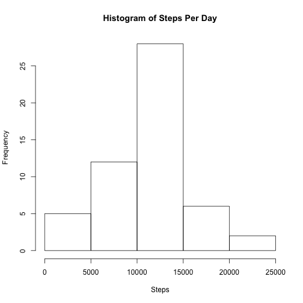
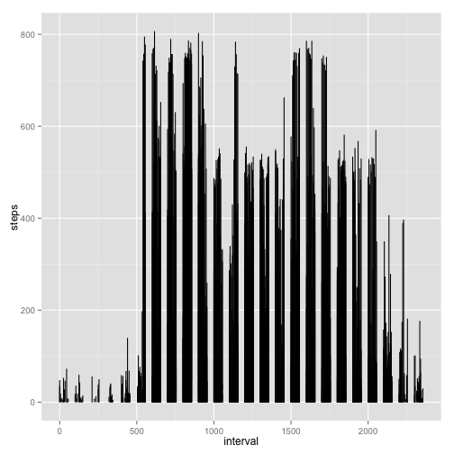
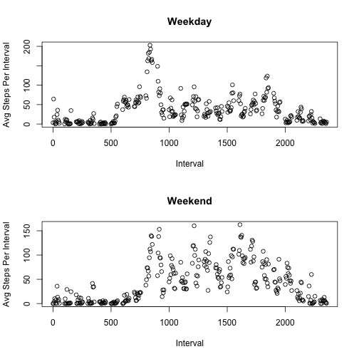

## Mark Meehan 10 Nov 2015
  
##title: "Reproducible Research: Peer Assessment 1"
 output:html_document:
 keep_md: true
##---


## Loading and preprocessing the data
### Default location under the user and then path as indicated

```r
activity <- read.csv("~/data/activity.csv")
```
## What is mean total number of steps taken per day?
###First aggregate by each date

```r
stepsPerDay <- aggregate(steps ~ date, data = activity, FUN = sum)
hist(stepsPerDay$steps, xlab = "Steps", main = "Histogram of Steps Per Day")
```

 
## What is the average daily activity pattern?

```r
hist(bactivity$steps, xlab = "Steps", main = "Histogram of Steps")
```

```
## Error in hist(bactivity$steps, xlab = "Steps", main = "Histogram of Steps"): object 'bactivity' not found
```
### Calculate the mean of the steps per day
### First modify the data to have a list by day of the steps 

```r
agglength.activity <- aggregate(activity$steps ~ activity$date, FUN = length)
```
### Calculate the mean of the steps per day

```r
a.mean <- lapply(agglength.activity$`activity$steps`, mean)
```
### Calculate the median of the steps per day

```r
a.median <- lapply(agglength.activity$`activity$steps`, median)
```
### Time series plot. I think the instructions wanted us to use the generic plot function
### but the ggplot is much easier to read so I will use it

```r
require(ggplot2)
ggplot(data = activity, aes(interval, steps)) + geom_line()
```

```
## Warning: Removed 2 rows containing missing values (geom_path).
```

 
### In answer to the question of which interval has the max number of steps - looking 
### carefully at the plot it would be the 550-600 minute timeframe 
### Imputing missing values
### First, figure out how many cases have NA values

```r
sum(is.na(activity))
```

```
## [1] 2304
```
### This comes out to 2304
### Lets create a new table for the next part since we'll be filling mission values
### And to save typing I will use a temp variable called 'b'

```r
activity_by_interval <- aggregate(activity$steps ~ activity$interval, FUN = sum)
b <- activity_by_interval
```
### In doing some research to figure out a manner of filling in missing values I came
### across a package called 'mice' which stands for multivariat imputation by chained equations
### See the book "R in Action" by Robert I Kabacoff. You'll need to download the 'mice'
### package at this point but it will be worth it 

```r
library(mice)
imp <- mice(c.new, seed=1234)
```

```
## 
##  iter imp variable
##   1   1  steps
##   1   2  steps
##   1   3  steps
##   1   4  steps
##   1   5  steps
##   2   1  steps
##   2   2  steps
##   2   3  steps
##   2   4  steps
##   2   5  steps
##   3   1  steps
##   3   2  steps
##   3   3  steps
##   3   4  steps
##   3   5  steps
##   4   1  steps
##   4   2  steps
##   4   3  steps
##   4   4  steps
##   4   5  steps
##   5   1  steps
##   5   2  steps
##   5   3  steps
##   5   4  steps
##   5   5  steps
```

```r
fit <- with(imp, lm(c.new$steps ~ c.new$interval))
pooled <- pool(fit)
d.new <- complete(imp, action = 3)
```
### Now look at the updated means and medians

```r
d.median <- lapply(d.stepsPerDay$steps, median)
d.mean <- lapply(d.stepsPerDay$steps, mean)
```
## Are there differences in activity patterns between weekdays and weekends?
### First I'll just subset the data based on the boolean 'weekend' variable

```r
weekday <- subset(d.new, d.new$weekend == FALSE)
weekend <- subset(d.new, d.new$weekend == TRUE)
```
### Create the average steps by interval

```r
avg_weekend <- aggregate(weekend$steps ~ weekend$interval, FUN = mean)
```

```
## Warning in is.na(rows): is.na() applied to non-(list or vector) of type
## 'NULL'
```

```
## Error in aggregate.data.frame(mf[1L], mf[-1L], FUN = FUN, ...): no rows to aggregate
```

```r
avg_weekday <- aggregate(weekday$steps ~ weekday$interval, FUN = mean)
```

```
## Warning in is.na(rows): is.na() applied to non-(list or vector) of type
## 'NULL'
```

```
## Error in aggregate.data.frame(mf[1L], mf[-1L], FUN = FUN, ...): no rows to aggregate
```
### Plot the results first by changing the layout to 1 column and 2 rows of plotting area

```r
par(mfrow = c(2, 1))
plot(avg_weekday$`weekday$interval`, avg_weekday$`weekday$steps`, main = "Weekday", xlab = "Interval", ylab = "Avg Steps Per Interval" )
plot(avg_weekend$`weekend$interval`, avg_weekend$`weekend$steps`, main = "Weekend", xlab = "Interval", ylab = "Avg Steps Per Interval" )
```

 
